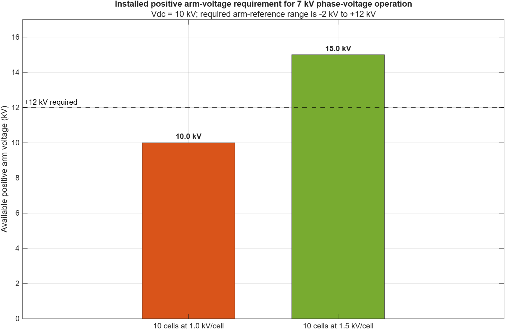
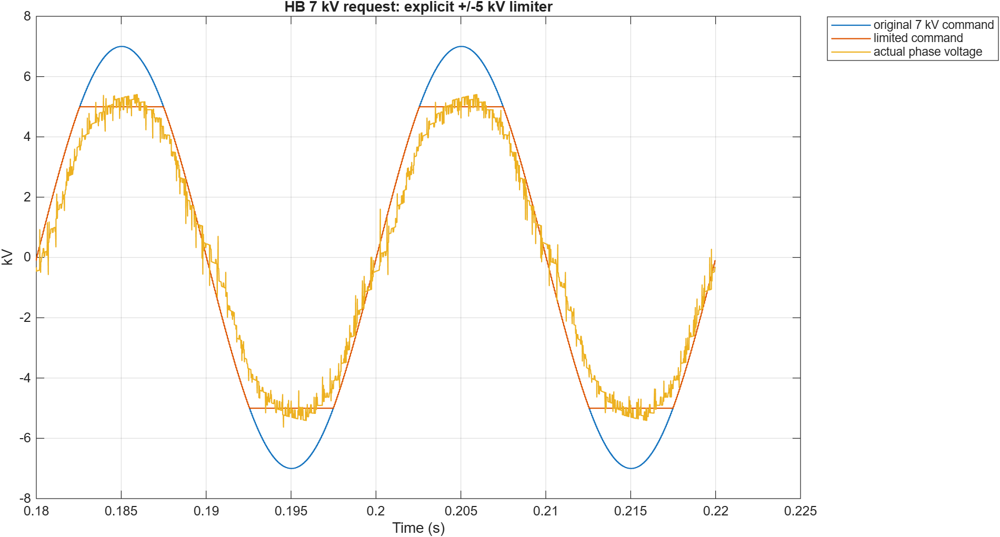
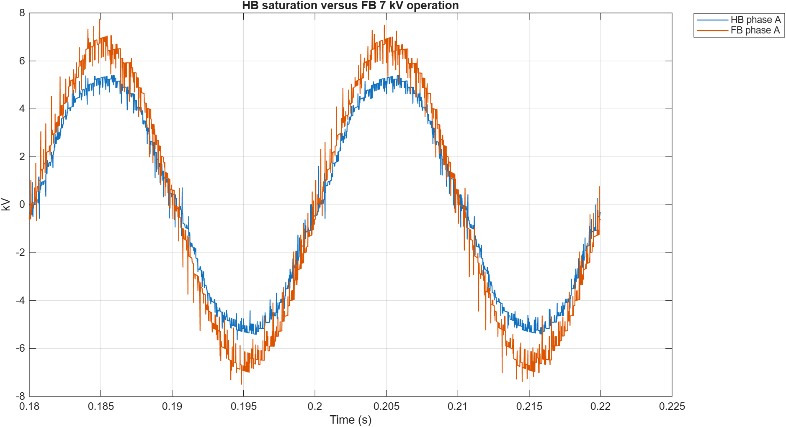
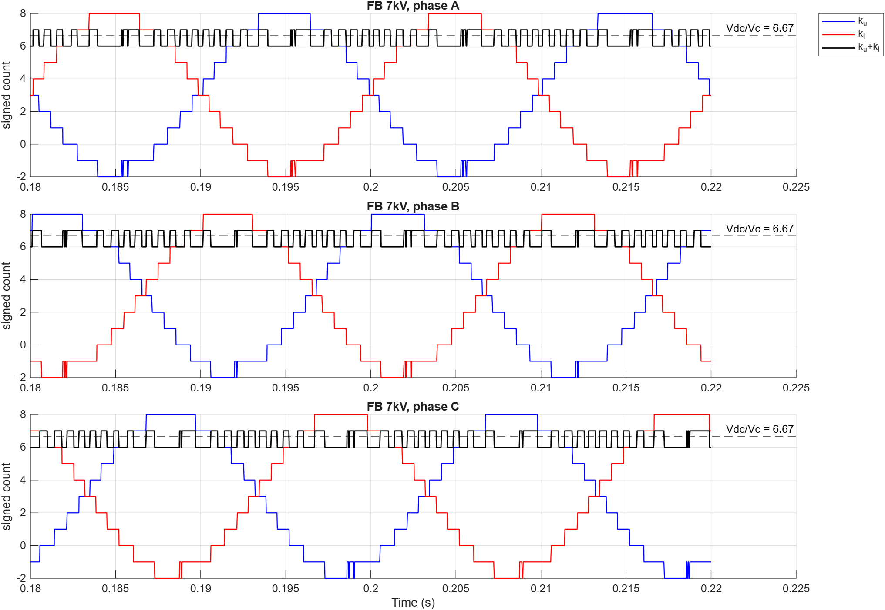
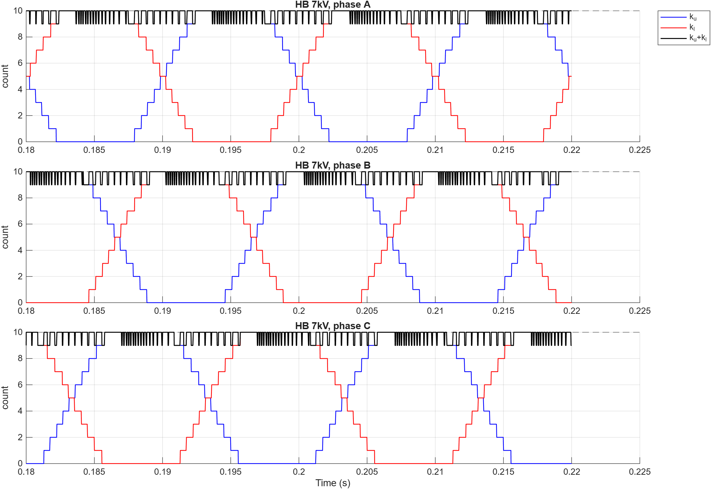
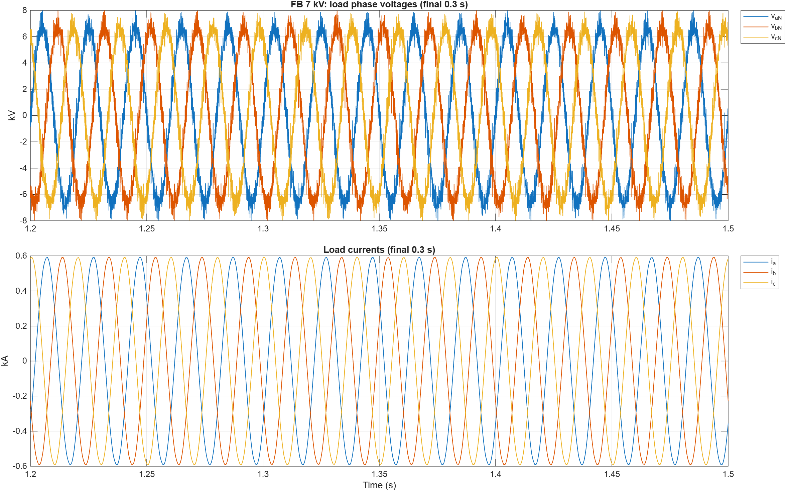
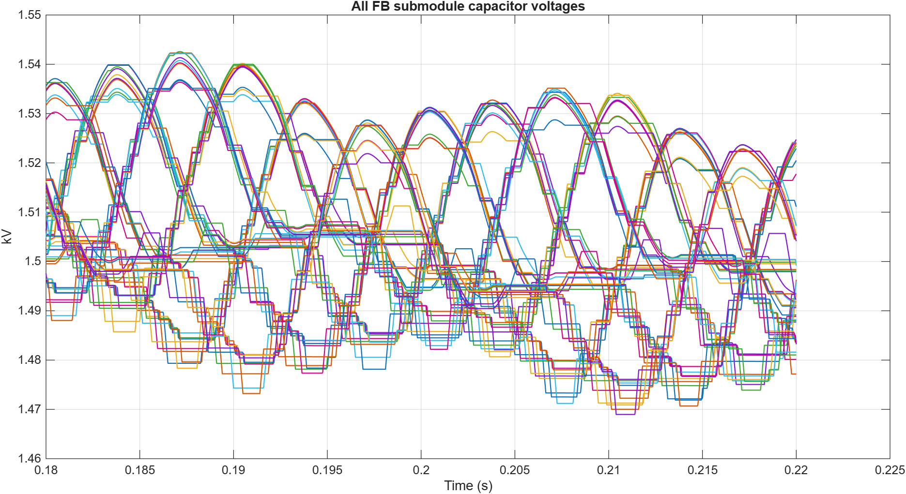

# HB-MMC versus FB-MMC voltage-limit comparison

## Motivation

This project is a switching-level Simulink/Simscape Electrical comparison of
three-phase half-bridge (HB) and full-bridge (FB) modular multilevel converters.
It focuses on one question: how do DC-link voltage, installed arm voltage, and
negative submodule insertion determine the maximum achievable AC phase voltage?

## Main physical idea

For one phase leg,

`v_phase = (v_lower - v_upper) / 2`

with arm references

`v_upper_ref = Vdc/2 - v_phase_ref`

`v_lower_ref = Vdc/2 + v_phase_ref`

The models contain explicit switching IGBTs and antiparallel diodes, individual
submodule capacitors, arm reactors, nearest-level modulation (NLM), and
Sort-and-Select capacitor balancing. No averaged MMC or controlled voltage
source is used to create the reported output.

## System parameters

| Parameter | HB-MMC | FB-MMC |
| --- | ---: | ---: |
| DC link | 10 kV | 10 kV |
| Submodules per arm | 10 | 10 |
| Capacitor reference | 1.0 kV | 1.5 kV |
| Installed arm-voltage range | 0 to +10 kV | -15 to +15 kV |
| Cell capacitance | 15 mF | 10 mF |
| Arm impedance | 10 mH, 0.2 ohm | 10 mH, 0.2 ohm |
| Phase-voltage commands | 4, 5, 7 kV peak | 4, 5, 7 kV peak |

## HB versus FB voltage limit

An HB submodule produces only 0 or +Vc. Both arm references must remain
nonnegative, giving the conventional limit

`|v_phase| <= Vdc/2`

For this 10 kV DC link, the HB command is therefore limited to +/-5 kV. The
7 kV command is visibly clipped and cannot be tracked as a sinusoidal 7 kV
phase voltage.

An FB submodule produces +Vc, 0, or -Vc. At a 7 kV phase-voltage peak,

`v_upper_ref = 5 - 7 = -2 kV`

`v_lower_ref = 5 + 7 = 12 kV`

The FB converter therefore needs both negative insertion capability and enough
installed positive arm voltage. Ten 1 kV cells would provide only 10 kV and
would still be insufficient. Ten 1.5 kV cells provide +/-15 kV, making the
-2 kV to +12 kV requirement feasible.

Inserted counts follow the same distinction. For HB,

`k_upper + k_lower ~= N = 10`

For FB, counts are signed and approximately satisfy

`(k_upper + k_lower) * Vc_FB ~= Vdc`

so

`k_upper + k_lower ~= 10 / 1.5 = 6.67`

The absolute FB counts do not need to sum to N.

## Key simulation observations

- HB 7 kV is limited to +/-5 kV.
- FB 7 kV reaches about 6.77 kV peak in the 220 ms comparison.
- FB 7 kV reaches about 7.00 kV peak in the independent 1.5 s run.
- The 1.5 s final-window THD is about 2.06%.
- FB uses up to two negatively inserted submodules in the 7 kV case.
- The 1.5 s capacitor mean remains approximately 1.50 kV and currents remain bounded.

Detailed numerical results are kept in the text and CSV files under `results/`.

## Important figures

### Installed positive arm-voltage requirement for 7 kV phase-voltage operation



To produce a 7 kV phase-voltage peak with a 10 kV DC link, the lower arm must
reach about +12 kV while the upper arm must reach about -2 kV. Negative
insertion alone is therefore not sufficient: the FB converter also needs
enough installed positive arm voltage. Ten cells at 1.0 kV/cell provide only
10 kV and cannot meet the +12 kV requirement. Ten cells at 1.5 kV/cell provide
15 kV, making the operating point feasible.

### HB 7 kV limiter



### HB versus FB output at the 7 kV command



### FB signed inserted-count sums



### HB inserted-count sums



### FB 1.5 s output voltage and current



Only the final 1.2-1.5 s window is shown so the steady-state voltage and current
waveforms remain readable.

### FB capacitor-voltage balancing at 7 kV



The individual FB submodule capacitor voltages remain clustered around the
1.5 kV target. Their bounded spread demonstrates effective Sort-and-Select
balancing in the 7 kV case and shows that negative insertion is achieved
without losing capacitor-voltage balance.

## How to run

From MATLAB with the repository root as the current folder:

```matlab
run scripts/init_mmc_comparison.m
run scripts/run_mmc_comparison.m
run scripts/analyze_mmc_comparison.m
run scripts/verify_submodule_and_balancing.m
```

The large MAT results are intentionally excluded from GitHub. The scripts
regenerate the six switching cases locally.

The optional 1.5 s FB run is computationally expensive:

```matlab
run scripts/run_fb_7kV_long.m
run scripts/analyze_fb_7kV_long.m
```

## Repository structure

```text
models/   Top-level converters, reusable arms, and HB/FB submodules
scripts/  Initialization, control, simulation, analysis, and verification
docs/     Detailed physical and implementation explanation
figures/  Selected 10 kV figures used for interpretation
results/  Compact CSV and text reports; no large MAT files
```

## Requirements

- MATLAB
- Simulink
- Simscape
- Simscape Electrical

MATLAB R2025a or newer is recommended. Simulation time depends strongly on
CPU performance because all 60 submodules are switching-level physical models.

## Limitations

- Semiconductor switching and conduction are idealized; thermal behavior is omitted.
- Ten cells per arm produce a coarse 1.0/1.5 kV staircase.
- Dead-time and diode commutation create narrow voltage and power spikes.
- Precharge, faults, insulation coordination, and protection are outside scope.
- The model demonstrates voltage capability and balancing, not a hardware-ready design.

## License

Released under the [MIT License](LICENSE).
